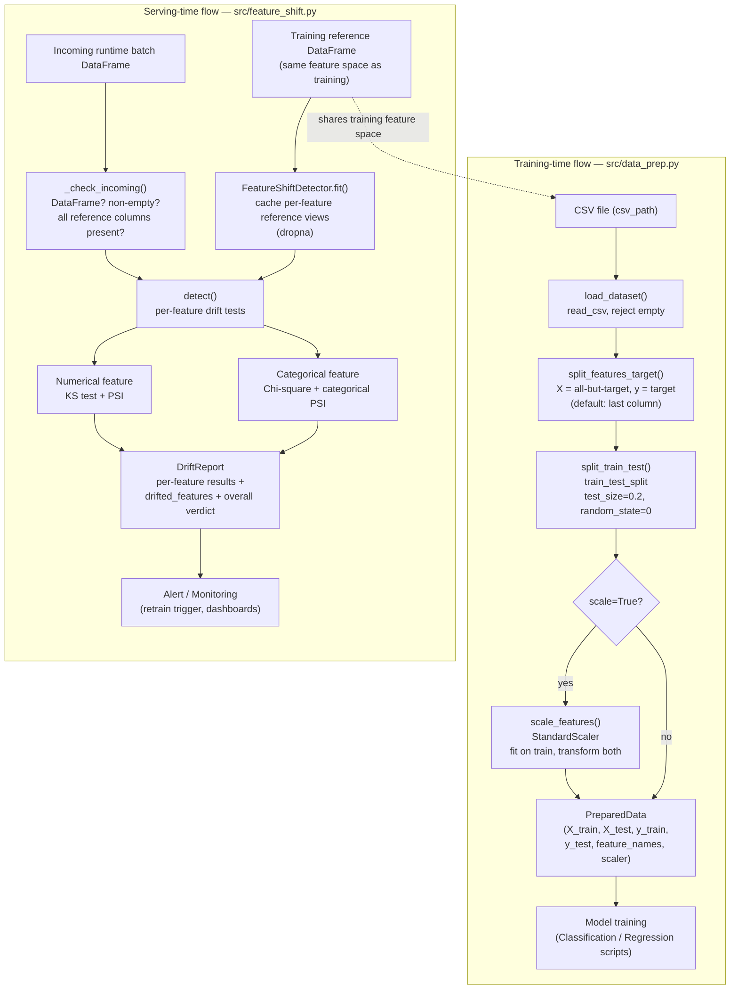
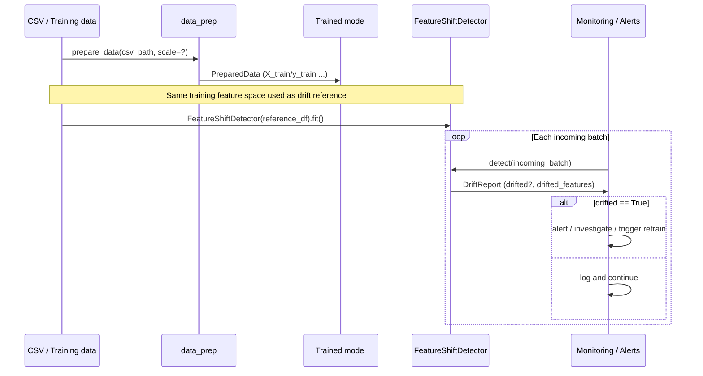

# System Flow — Data Prep & Feature-Shift Detection

_Last updated: 2026-06-08_

This document describes the architecture and data flow for the two new modules
added to `MyMLTool`:

- `src/data_prep.py` — a reusable **training-time** data-preparation pipeline.
- `src/feature_shift.py` — a **serving-time** feature-shift / data-drift detector.

The two modules are complementary halves of the model lifecycle: `data_prep`
produces the data a model is trained on, and `feature_shift` watches incoming
production traffic to verify it still resembles that same training distribution.

---

## 1. High-level overview

| Module | Phase | Input | Output | Responsibility |
|--------|-------|-------|--------|----------------|
| `data_prep` | Training | CSV path | `PreparedData` (train/test arrays + scaler) | Load, split features/target, train/test split, optional standard-scaling — replaces logic duplicated across `Classification/` and `Regression/` scripts |
| `feature_shift` | Serving | Reference DataFrame + incoming batch DataFrame | `DriftReport` | Compare each incoming batch against the training reference and flag distributional drift per feature and overall |

The modules do not call each other. They share a conceptual contract: the
DataFrame used to build the `FeatureShiftDetector` reference should be the same
training data fed through `data_prep` (before scaling), so drift is measured in
the model's original feature space.

---

## 2. Combined data flow (Mermaid)



---

## 3. Training-time component: `data_prep`

### Public API

| Function | Signature (key params) | Returns | Notes |
|----------|------------------------|---------|-------|
| `load_dataset` | `load_dataset(csv_path)` | `DataFrame` | Raises `FileNotFoundError` for missing path; `ValueError` for empty file / zero rows |
| `split_features_target` | `split_features_target(df, target_col=-1)` | `(X, y, feature_names)` | Last column is target by default; `target_col` may be name or integer position; needs >=2 columns |
| `split_train_test` | `split_train_test(X, y, test_size=0.2, random_state=0)` | `(X_train, X_test, y_train, y_test)` | Wraps `sklearn.model_selection.train_test_split` |
| `scale_features` | `scale_features(X_train, X_test)` | `(X_train_scaled, X_test_scaled, scaler)` | `StandardScaler` fit on train, applied to both — no train/test leakage |
| `prepare_data` | `prepare_data(csv_path, target_col=-1, test_size=0.2, random_state=0, scale=False)` | `PreparedData` | Full pipeline end-to-end |

### Constants

| Constant | Value | Meaning |
|----------|-------|---------|
| `DEFAULT_TEST_SIZE` | `0.2` | Hold-out fraction for the test split |
| `DEFAULT_RANDOM_STATE` | `0` | Seed for reproducible splits |

### `PreparedData` (dataclass)

`X_train`, `X_test`, `y_train`, `y_test` (numpy arrays), `feature_names` (list),
and `scaler` (`Optional[StandardScaler]`, `None` when `scale=False`).

### Pipeline order

`load_dataset` -> `split_features_target` -> `split_train_test` -> (optional)
`scale_features` -> `PreparedData`. The scaler is fit **only** on the training
split to avoid leaking test-set statistics. The returned `scaler` is the same
object that must be persisted and applied to live data at serving time.

---

## 4. Serving-time component: `feature_shift`

### Responsibilities

`FeatureShiftDetector` holds a reference (training) DataFrame and, for each
incoming batch, runs a statistical test plus a PSI calculation per feature, then
aggregates the per-feature outcomes into a single `DriftReport`.

### Lifecycle

1. **Construct** — `FeatureShiftDetector(reference_df, categorical_features=None, alpha=0.05, psi_threshold=0.25, bins=10)`.
   - Rejects non-DataFrame (`TypeError`) and empty (`ValueError`) references.
   - If `categorical_features` is omitted, any non-numeric-dtype column is treated as categorical; the rest are numerical.
   - Unknown categorical feature names raise `ValueError`.
2. **`fit()`** — caches a per-column reference view with `dropna()`; sets `_fitted`; returns `self` for chaining. `detect()` auto-fits if called first.
3. **`detect(incoming_df)`** — validates the batch via `_check_incoming` (must be a non-empty DataFrame containing every reference column), runs per-feature tests, and returns a `DriftReport`.

### Drift signals and thresholds

| Feature type | Statistical test | Distribution metric | Source |
|--------------|------------------|---------------------|--------|
| Numerical | Two-sample Kolmogorov–Smirnov (`scipy.stats.ks_2samp`) | PSI over quantile bins of the reference | `ks_drift`, `compute_psi` |
| Categorical | Chi-square on a 2-row contingency table (`scipy.stats.chi2_contingency`) | Categorical PSI over per-category proportions | `chi2_drift`, `compute_categorical_psi` |

**Thresholds / constants:**

| Constant | Value | Role |
|----------|-------|------|
| `ALPHA` | `0.05` | Significance level — a test flags drift when `p_value < alpha` |
| `PSI_SHIFT` | `0.25` | Default `psi_threshold`; `psi >= threshold` flags drift |
| `PSI_NO_SHIFT` | `0.1` | Reference band — PSI below this is conventionally "no significant shift" |
| `DEFAULT_BINS` | `10` | Quantile bins used by numerical PSI |

PSI interpretation convention: `< 0.1` no significant shift; `0.1 – 0.25`
moderate shift; `>= 0.25` significant shift.

### How the signals combine

A feature is marked **drifted** when **either** signal fires:

```text
feature.drifted = (test.p_value < alpha) OR (psi >= psi_threshold)
```

This OR logic makes detection sensitive: the hypothesis test catches
statistically significant differences (powerful on large batches), while PSI
catches practically meaningful redistribution of mass even when a p-value is
borderline. Numerical PSI bins on quantiles of the reference (roughly
equal-mass buckets) and floors empty buckets to a small epsilon to keep the log
finite; categorical PSI and chi-square floor absent categories to epsilon so the
math stays defined when a category appears in only one sample. Near-constant
references degenerate gracefully (PSI returns `0.0`).

### `DriftReport`

| Field | Type | Meaning |
|-------|------|---------|
| `drifted` | `bool` | Overall verdict — `True` if any feature drifted |
| `drifted_features` | `list` | Names of the features that drifted |
| `n_features` | `int` | Number of features evaluated |
| `results` | `list[FeatureResult]` | Per-feature `feature`, `type`, `test`, `statistic`, `p_value`, `psi`, `drifted` |

`DriftReport.to_dict()` serialises the report (including each `FeatureResult`)
to a plain dict for logging, dashboards, or alerting pipelines.

---

## 5. How the two modules interact



The link between the modules is the **training feature space**: the DataFrame
used to build the detector's reference must match the features produced by
`split_features_target` before scaling, so drift is interpreted in the model's
native input space. When `detect` reports drift, the natural remediation is to
re-run `prepare_data` on fresh data and retrain the model — closing the loop.

---

## 6. Validation and error handling summary

| Stage | Guard | Raised |
|-------|-------|--------|
| `load_dataset` | Missing file | `FileNotFoundError` |
| `load_dataset` | Empty / zero-row CSV | `ValueError` |
| `split_features_target` | `< 2` columns, or unknown target name | `ValueError` |
| Detector construction | Non-DataFrame reference | `TypeError` |
| Detector construction | Empty reference, unknown categorical names | `ValueError` |
| `detect` / `_check_incoming` | Non-DataFrame, empty, or missing columns | `TypeError` / `ValueError` |
| PSI / KS / Chi-square helpers | Empty samples / no categories | `ValueError` |

All error paths use specific exception types — there are no bare `except`
clauses — which keeps malformed or adversarial inputs failing fast and loudly.
