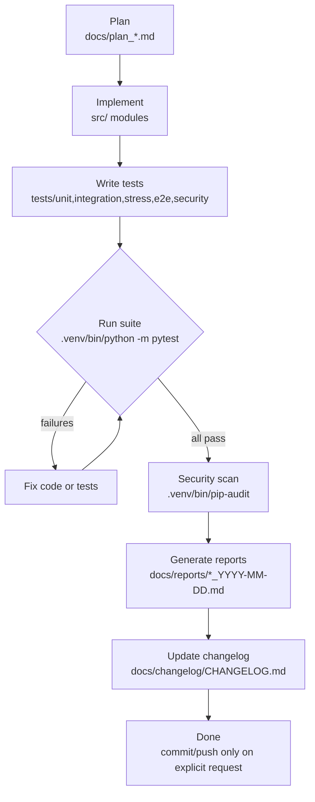

# Development Workflow

> Project: **MyMLTool** — Python ML utilities (`src/data_prep.py`, `src/feature_shift.py`)
> and the **`src/nlp/` 公文 NLP pipeline** (see §8).
> Last updated: 2026-07-21.

This document describes the environment setup, build, test, security-scan, and
reporting workflow for this project, and how they map to the mandatory
**Plan -> Implement -> Test -> Reports -> Changelog** flow defined in `CLAUDE.md`.

---

## 1. Environment Setup

The project targets **Python 3.12** and uses an isolated virtual environment in `.venv/`.

> **Note:** On this environment the system `pip`/`ensurepip` module is **absent**, so
> `python3 -m venv .venv` creates the venv **without** `pip`. `pip` must be bootstrapped
> manually via `get-pip.py` before installing dependencies.

```bash
# 1. Create the virtual environment (no pip yet — ensurepip unavailable)
python3 -m venv .venv

# 2. Bootstrap pip into the venv
curl -sS https://bootstrap.pypa.io/get-pip.py -o get-pip.py
.venv/bin/python get-pip.py

# 3. Install project + test + security dependencies
.venv/bin/pip install -r requirements.txt
```

### Dependencies (`requirements.txt`)

| Package | Constraint | Role |
|---------|-----------|------|
| `numpy` | `>=1.26` | numerical arrays |
| `pandas` | `>=2.1` | dataframe / CSV loading |
| `scikit-learn` | `>=1.4` | `train_test_split`, `StandardScaler` |
| `scipy` | `>=1.12` | `ks_2samp`, `chi2_contingency` (drift tests) |
| `pytest` | `>=8.0` | test runner |
| `pytest-cov` | `>=5.0` | coverage measurement |
| `pip-audit` | `>=2.7` | dependency vulnerability scan |

Always invoke tools through the venv interpreter (`.venv/bin/python -m ...`) so the
correct interpreter and installed packages are used regardless of shell activation state.

---

## 2. Project Layout

```
MyMLTool/
├── src/                       # source modules (data_prep, feature_shift)
├── tests/
│   ├── conftest.py            # shared fixtures
│   ├── unit/                  # function/method isolation tests
│   ├── integration/           # cross-module interaction tests
│   ├── stress/                # volume / performance tests
│   ├── e2e/                   # full workflow tests
│   └── security/              # SAST / secret / input-validation tests
├── docs/                      # plan, flow, workflow, changelog, issues, reports
├── output/                    # generated artifacts (coverage, scans) — gitignored
├── pytest.ini                 # pytest config (testpaths, markers, coverage)
└── requirements.txt
```

`.gitignore` excludes `.venv/`, `output/`, and caches.

---

## 3. Running the Test Suite

Test configuration lives in `pytest.ini`:

```ini
[pytest]
testpaths = tests
python_files = test_*.py
addopts = -ra --strict-markers --cov=src --cov-report=term-missing --cov-report=html:output/htmlcov
markers =
    unit | integration | stress | e2e | security
```

This means a bare `pytest` invocation automatically:
- discovers tests under `tests/`,
- measures **line coverage on `src/`**,
- prints missing lines (`term-missing`),
- writes an **HTML coverage report to `output/htmlcov/`**, and
- enforces `--strict-markers` (unregistered markers fail the run).

### Run everything

```bash
.venv/bin/python -m pytest
```

### Run a single category (markers)

```bash
.venv/bin/python -m pytest -m unit
.venv/bin/python -m pytest -m integration
.venv/bin/python -m pytest -m stress
.venv/bin/python -m pytest -m e2e
.venv/bin/python -m pytest -m security
```

### Useful variants

```bash
# Slowest-test timing + a single file
.venv/bin/python -m pytest --durations=10 tests/unit/test_data_prep.py

# Capture full output to an artifact for the test report
.venv/bin/python -m pytest -ra --durations=0 | tee output/pytest_full.txt
```

### Latest results (2026-06-08)

| Metric | Value |
|--------|-------|
| Total | **71 passed**, 0 failed, 0 skipped |
| Wall time | 26.20s |
| Framework | pytest 9.0.3 / Python 3.12.3 (linux) |
| Coverage (line) | **100%** — 180 statements, 0 missed |
| `src/data_prep.py` | 100% |
| `src/feature_shift.py` | 100% |
| `src/__init__.py` | 100% |

Per-category counts:

| Category | Count |
|----------|-------|
| unit | 41 |
| integration | 5 |
| stress | 5 |
| e2e | 3 |
| security | 17 |

Stress highlights: `test_repeated_detect_is_stable` 11.27s (50 sequential `detect()`
calls over a 200k-row x ~14-col frame, ~4.4 detect-calls/sec); fit()+detect() under
time budget 0.41s; split+scale 0.08s. No test exceeded its time budget.

---

## 4. Security Dependency Scan

`pip-audit` runs against the installed venv dependency tree:

```bash
# Human-readable
.venv/bin/pip-audit

# Machine-readable artifact for the security report
.venv/bin/pip-audit -f json -o output/pip_audit.json
```

Latest scan (pip-audit 2.10.0): **No known vulnerabilities found** across all installed
dependencies (numpy 2.4.6, pandas 3.0.3, scikit-learn 1.9.0, scipy 1.17.1, and
transitive deps). Raw output: `output/pip_audit.json`.

SAST / input-validation checks are part of the `security` test category (17 tests):
no `eval`/`exec`/`os.system`/untrusted `pickle.load` in `src/*.py`, no hardcoded
secrets, malformed/empty/garbage CSV raise specific exceptions (no bare `except`),
and `FeatureShiftDetector` rejects missing/renamed/empty/non-DataFrame inputs.

> This is an offline utility library: no network endpoints, auth, database, or
> untrusted deserialization, so several OWASP **web** categories are N/A.

---

## 5. Report Generation

After all tests pass and the scan completes, generate the three reports required by
`CLAUDE.md` into `docs/reports/`, dated with the generation day:

| Report | File |
|--------|------|
| Test Report | `docs/reports/test_report_2026-06-08.md` |
| Security Report | `docs/reports/security_report_2026-06-08.md` |
| Code Review Report | `docs/reports/code_review_2026-06-08.md` |

Source data for the reports:
- `output/pytest_full.txt` — full `pytest -ra --durations` output
- `output/htmlcov/` — HTML line-coverage report
- `output/pip_audit.json` — dependency scan results
- `output/category_counts.txt` — per-category test counts

All program-generated artifacts go under `output/` (gitignored); reports themselves are
committed under `docs/reports/`. If multiple reports are generated the same day, append a
sequence suffix (e.g. `test_report_2026-06-08_02.md`).

---

## 6. End-to-End Development Flow (CLAUDE.md)

The mandatory order from `CLAUDE.md` is:

```
Plan → Decompose → Implement → Test → Fix → Reports → Code Review → Changelog → Done
```



Workflow rules to remember:
1. **Plan first** — no code without a plan file under `docs/`.
2. **Never skip testing** — all five categories must exist and pass.
3. **Never skip reports** — Test, Security, and Code Review reports must all exist.
4. **Always update the changelog** (Keep a Changelog format) after every change.
5. **Never commit/push automatically** — wait for explicit user instruction.
6. Log any development issue in `docs/issues/ISSUE_NNN.md` (Problem / Cause / Solution / Prevention).

> During this change, 4 integration/e2e tests initially failed due to **test-side**
> issues (rebuilding the detector reference from a mixed-dtype object array, training
> `LogisticRegression`/`StandardScaler` on a string column, and asserting zero KS
> false-positives). All were fixed in the tests; the `src` modules were correct.

---

## 8. 公文 NLP Pipeline (`src/nlp/`) — 2026-07-21

### Environment

The NLP pipeline adds heavy deps split into `requirements-nlp.txt` (torch≥2.7,
transformers, spaCy, sentence-transformers, setfit, lightgbm). Install torch by
platform FIRST (see `docs/nlp/INSTALL.md`): x86_64 4070/5070 Ti → cu128 index;
GB10/ARM64 → NVIDIA aarch64 wheel; CI → cpu. Development/testing runs in the
**WSL (Ubuntu 24.04) venv** with a real RTX 4070 visible.

```bash
# Run the NLP suite (WSL). HF_HUB_OFFLINE avoids accidental model downloads.
wsl -e bash -lc "cd /mnt/d/IT/githubProbject/MyMLTool && \
  HF_HUB_OFFLINE=1 .venv/bin/python -m pytest -k nlp -q"

# CLI (also the Docker entrypoint)
.venv/bin/python -m src.nlp.cli diagnose
.venv/bin/python -m src.nlp.cli eda --config configs/eda.example.yaml
.venv/bin/python -m src.nlp.cli feature-select --config configs/feature_select.example.yaml
.venv/bin/python -m src.nlp.cli benchmark --config configs/benchmark.example.yaml
```

### New pytest markers

`gpu` (needs CUDA), `slow`, `network` (needs model download) — all registered in
`pytest.ini`; GPU/network/LightGBM tests skip-gate so a bare run stays green.

### Latest NLP results (2026-07-21)

| Metric | Value |
|--------|-------|
| Total (whole repo) | **427 passed, 2 skipped** |
| Line coverage (`src/`) | **91%** |
| Skips | `tfidf_gbm` (libgomp absent in WSL; present in Docker), `setfit` (transformers 5.x incompat + network) |
| Real-GPU check | RTX 4070 → `architecture: ada`, `precision: bf16`, `compatibility: OK` |

### Docker delivery

```bash
docker build -t mymltool-nlp:latest .
python scripts/download_models.py --dest ./models      # offline model pre-fetch
docker save -o mymltool-nlp.tar mymltool-nlp:latest    # air-gapped transfer
docker compose run --rm nlp diagnose                    # on-site verification
```

See `docs/nlp/DEPLOYMENT.md` for the full customer-site procedure and
`docs/nlp/LICENSES.md` for the compliance inventory (no China-origin packages;
GPL/AGPL excluded from the default image).
